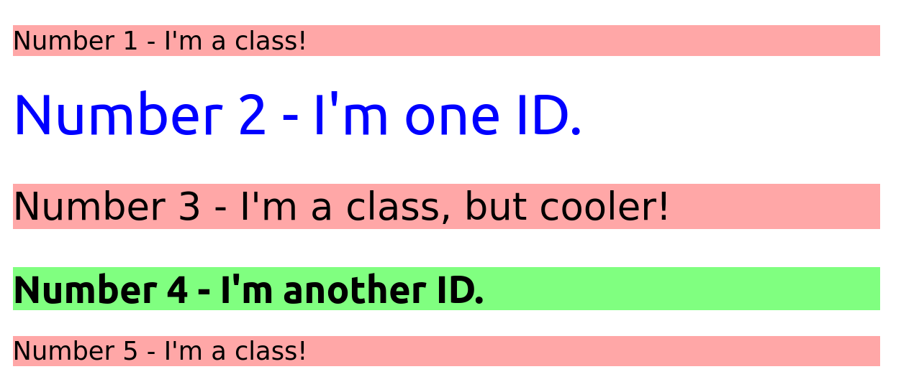

<<<<<<< HEAD
# CSS Exercises

These exercises are a series of CSS related tasks intended to complement the HTML and CSS content on The Odin Project (TOP). They should only be done when instructed during the course of the curriculum.

When doing these exercises, please use all the documentation and resources you need to accomplish them. You are _not_ intended to have any of this stuff memorized at this point. Check the docs, use Google, do what you need to do (besides checking the solutions) to get them done.

## Contributing

If you have a suggestion to improve an exercise, an idea for a new exercise, or notice an issue with an exercise, please feel free to open an issue after thoroughly reading our [contributing guide](https://github.com/TheOdinProject/theodinproject/blob/main/CONTRIBUTING.md) in our main TOP repo.

## How To Use These Exercises 

1. Fork and clone this repository. To learn how to fork a repository, see the GitHub documentation on how to [fork a repo](https://docs.github.com/en/get-started/quickstart/fork-a-repo). 
    * Copies of repositories on your machine are called clones. If you need help cloning to your local environment you can learn how from the GitHub documentation on [cloning a repository](https://docs.github.com/en/github/creating-cloning-and-archiving-repositories/cloning-a-repository-from-github/cloning-a-repository).
2. Go to an exercise directory and open the HTML file in your browser. You can either open the file directly, or use something like VSCode's Live Server extension.
3. For each exercise, read the README thoroughly before starting any work.
    * Each README has a "Self Check" list. Use this to make sure you haven't missed any important details in your implementation.
4. Make your edits in the `index.html` and/or the `style.css` files in order to make the output in your browser look like the Desired Outcome image(s). 
    * Depending on the instructions of the exercise, you may only need to make edits in one of these files.
5. Once you successfully finish an exercise, check TOP's solution to compare it with yours. 
   * You should not be checking the solution for an exercise until you finish it!
   * Keep in mind that TOP's solution is not the only solution. If your solution differs wildly from TOP's solution (and still passes the self-check criteria), feel free to ask about it in the chatroom.
6. Do not submit your solutions to this repo, as any PRs that do so will be closed without merging.

## Some Hints
- The official solutions put all changes at the _end_ of the CSS file, which may duplicate some selectors (e.g. there might be a `body {}` in the given CSS, and another `body {}` in the solution). When you are working on an exercise, it is best practice to add your CSS to existing selectors instead of duplicating them at the end of the file. We're sacrificing this best practice in our official solutions to make it extra clear to you what things we changed to solve the exercise.
- Unless listed in the self-check section, do not worry about getting the exact pixel value for things like margin, padding and font-size. These exercises are intended to test your knowledge of CSS, not your ability to guess that a screenshot is using `font: sans-serif bold 16px`, or that the margin is _exactly_ `42px`.
- You may need to add some elements to your HTML to get things into the right spot. (For the first few exercises we make it explicit when this needs to happen.)
- You may need to add more selectors to your CSS file. The first few exercises have almost everything already done for you, but as you progress you'll find that you need to add more and more to get the correct result.
=======
# Class and ID Selectors
Knowing how to add class and ID attributes to HTML elements, as well as use their respective selectors, is invaluable. It's important to practice using them.

There are several elements in the HTML file provided, which you will have to add either class or ID attributes to, as noted in the outcome image below. You will then have to add rules in the CSS file provided using the correct selector syntax. Look over the outcome image carefully, and try to keep in mind which elements look similarly styled (classes), which ones may be completely unique from the rest (ID), and which ones have slight variations from others (multiple classes).

It isn't entirely important which class or ID values you use, as the focus here is on being able to add the attributes and use the correct selector syntax to style elements. For the colors in this exercise, try using a non-keyword value (RGB, HEX, or HSL). The properties you need to add to each element are:

* **All odd numbered elements**: a light red/pink background, and a list of fonts containing `Verdana` and `DejaVu Sans` with `sans-serif` as a fallback
* **The second element**: blue text and a font size of 36px
* **The third element**: in addition to the styles for all odd numbered elements, add a font size of 24px
* **The fourth element**: a light green background, a font size of 24px, and bold

Quick tip: in VS Code, you can change which format colors are displayed in RGB, HEX, or HSL by hovering over the color value in the CSS and clicking the top of the popup that appears!

> ### Note:
> Part of your task is to add a font to _some_ of these items. Your browser's font's might be different than the one displayed in the desired outcome image. As long as you confirm that the fonts _are_ being applied to the right lines any differences are okay for this exercise.

## Desired Outcome

### Self Check
- Do the odd numbered `p` elements share a class?
- Do the even numbered `div` elements have unique IDs?
- Does the Number 3 element have multiple classes?
>>>>>>> 62a919b (2 exercise)
